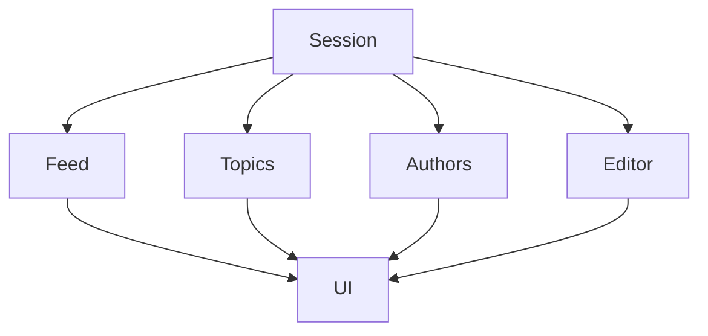

# 🎭 Управление состоянием

## 🎯 Контексты приложения

Контексты обеспечивают глобальное управление состоянием и данными в приложении.

### 📋 Основные контексты

| Контекст | Назначение | Основные данные |
|----------|------------|-----------------|
| **Session** | Аутентификация | Пользователь, токен, сессия |
| **Feed** | Ленты публикаций | Статьи, фильтры, пагинация |
| **Topics** | Тематическая навигация | Темы, категории, подписки |
| **Authors** | Авторы и профили | Авторы, подписки, статистика |
| **Editor** | Редактирование | Черновики, публикации |
| **UI** | Интерфейс | Модалы, уведомления, темы |

## 🔄 Session Context

Управление аутентификацией и пользовательскими сессиями.

### Основные функции
- **Аутентификация** — вход/выход через email/OAuth
- **Сессии** — управление JWT токенами
- **Пользователи** — данные профиля
- **Автообновление** — refresh токенов

### Использование
```typescript
const { session, signIn, signOut } = useSession()
```

## 📚 Feed Context

Управление лентами публикаций и контентом.

### Основные функции
- **Ленты** — recent, hot, top, followed
- **Фильтрация** — по темам, авторам, времени
- **Пагинация** — подгрузка контента
- **Кеширование** — локальное хранение

### Использование
```typescript
const { feed, loadFeed, updateFilters } = useFeed()
```

## 🏷️ Topics Context

Управление темами и категориями контента.

### Основные функции
- **Темы** — список доступных тем
- **Подписки** — отслеживание тем
- **Навигация** — переходы по темам
- **Кеширование** — локальное хранение

### Использование
```typescript
const { topics, subscribeToTopic } = useTopics()
```

## 👥 Authors Context

Управление авторами и социальными взаимодействиями.

### Основные функции
- **Авторы** — список и профили
- **Подписки** — отслеживание авторов
- **Статистика** — активность авторов
- **Поиск** — поиск по авторам

### Использование
```typescript
const { authors, followAuthor } = useAuthors()
```

## ✏️ Editor Context

Управление редактированием и публикациями.

### Основные функции
- **Черновики** — создание и сохранение
- **Публикации** — процесс публикации
- **Автосохранение** — локальное хранение
- **Коллаборация** — совместное редактирование

### Использование
```typescript
const { drafts, saveDraft, publishDraft } = useEditor()
```

## 🎨 UI Context

Управление интерфейсом и пользовательским опытом.

### Основные функции
- **Модалы** — управление всплывающими окнами
- **Уведомления** — toast и системные уведомления
- **Темы** — светлая/темная тема
- **Анимации** — управление переходами

### Использование
```typescript
const { showModal, hideModal, theme } = useUI()
```

## 🔗 Взаимодействие контекстов

Контексты взаимодействуют для обеспечения целостного состояния:



## 📊 Производительность

### Оптимизации контекстов
- **Гранулярные обновления** — только необходимые данные
- **Кеширование** — локальное хранение состояний
- **Отложенная загрузка** — загрузка данных по требованию
- **Автоматическая очистка** — удаление неиспользуемых данных

### Метрики
- **Время инициализации** — < 100ms для всех контекстов
- **Потребление памяти** — < 10MB для кешированных данных
- **Время обновления** — < 50ms для реактивных обновлений
