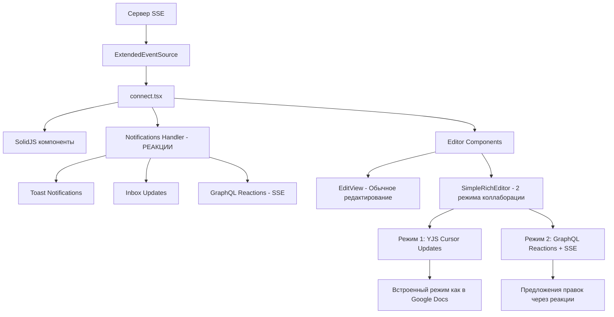
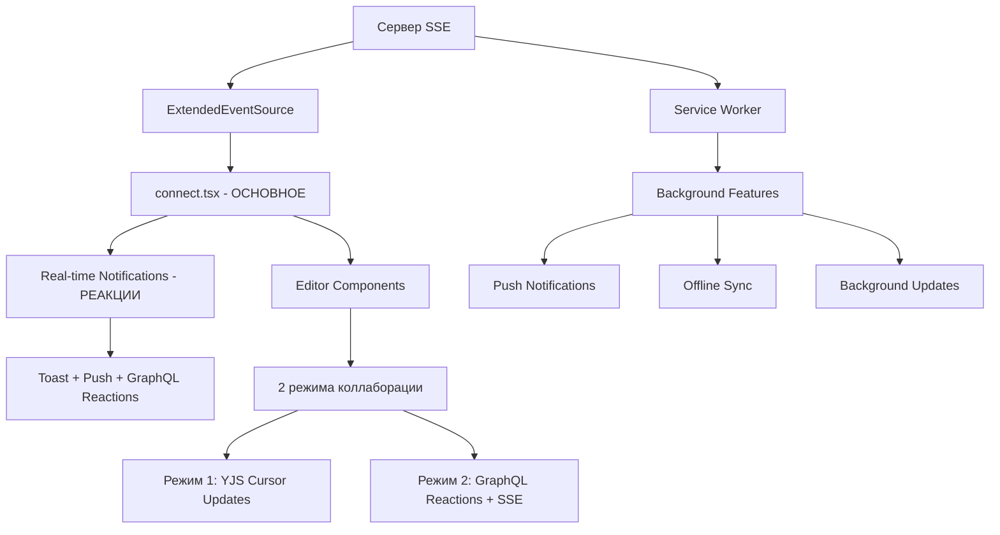
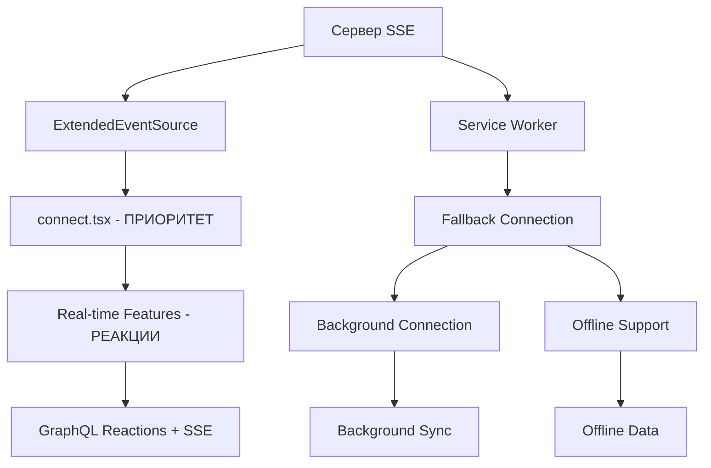
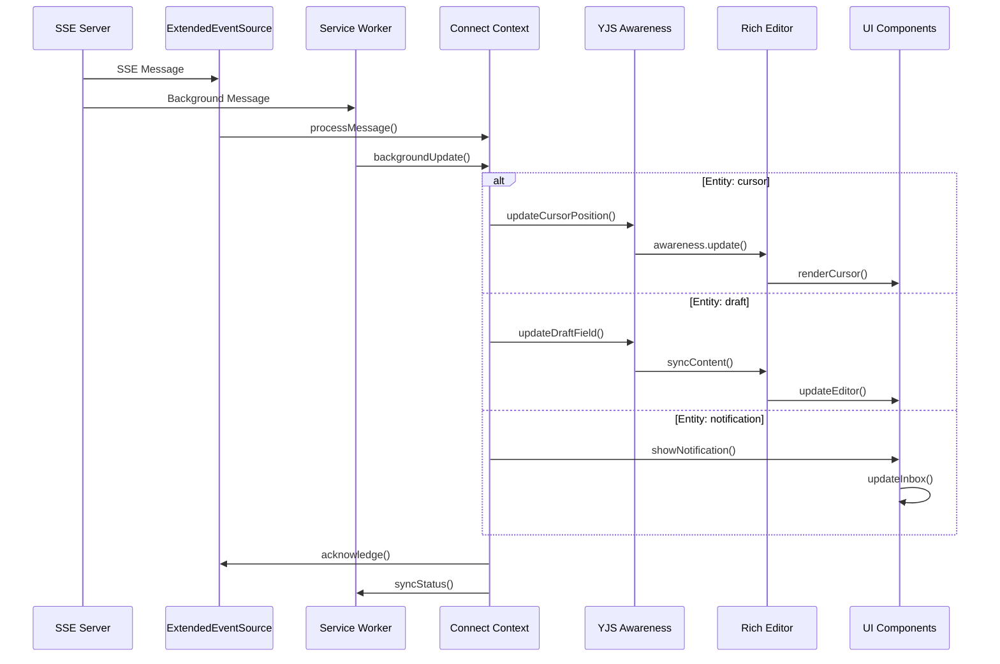

# SSE (Server-Sent Events) Architecture

## Обзор

Система SSE в Discours.io построена на **прямом клиентском соединении** через `src/context/connect.tsx`. Service Worker в настоящее время отключен, но может быть добавлен для расширения функциональности.

## 🚨 Текущее состояние

### ✅ **Работает сейчас**
- **Прямое SSE соединение** через `ExtendedEventSource`
- **YJS Awareness** для совместного редактирования
- **Обработка уведомлений** в реальном времени
- **Автоматическое переподключение** при разрыве соединения

### ❌ **Отключено/Не реализовано**
- **Service Worker** - полностью отключен (`public/sw.js`)
- **Background Sync** - не работает
- **Push-уведомления** - только при открытом браузере
- **Офлайн поддержка** - ограниченная

## Ключевые компоненты

### 1. Connect Context (`src/context/connect.tsx`) - **ОСНОВНОЙ**
- **Прямое SSE соединение** с сервером через `ExtendedEventSource`
- **YJS Awareness** для совместного редактирования
- **Обработка всех SSE сообщений** (курсоры, уведомления, черновики)
- **Автоматическое переподключение** и обработка ошибок

### 2. Service Worker (`public/sw.js`) - **ОТКЛЮЧЕН**
- В настоящее время неактивен
- Может быть добавлен для расширения функциональности

## Архитектура потока данных (ТЕКУЩАЯ)



## 🔄 Возможная гибридная архитектура

### Вариант 1: Service Worker как дополнение


### Вариант 2: Service Worker как fallback


### Детальная схема обработки сообщений


## 🔧 Реализация гибридного подхода

### 1. **Основное соединение остается прямым**
```typescript
// В connect.tsx - основное SSE соединение
const connect = async (): Promise<void> => {
  const eventSource = new ExtendedEventSource(
    import.meta.env.PUBLIC_REALTIME_EVENTS,
    { headers: { Authorization: `Bearer ${token}` } }
  )
  
  // Основная логика обработки SSE
  eventSource.onmessage = (event) => {
    const data = JSON.parse(event.data)
    handlers().forEach(handler => handler(data))
  }
}
```

### 2. **Service Worker как дополнение**
```typescript
// В sw.js - дополнительная функциональность
self.addEventListener('push', (event) => {
  // Push-уведомления когда браузер закрыт
  const data = event.data.json()
  self.registration.showNotification('Discours', {
    body: data.message,
    icon: '/logo.png'
  })
})

self.addEventListener('sync', (event) => {
  // Фоновая синхронизация при восстановлении интернета
  if (event.tag === 'draft-sync') {
    syncOfflineDrafts()
  }
})
```

### 3. **Координация между прямым соединением и SW**
```typescript
// В connect.tsx - проверяем поддержку SW
const checkServiceWorkerSupport = async () => {
  if ('serviceWorker' in navigator) {
    try {
      const registration = await navigator.serviceWorker.register('/sw.js')
      console.log('[Connect] Service Worker зарегистрирован:', registration)
      
      // Отправляем информацию о прямом соединении в SW
      registration.active?.postMessage({
        type: 'DIRECT_CONNECTION_STATUS',
        status: status(),
        lastMessage: lastMessage()
      })
    } catch (error) {
      console.warn('[Connect] Service Worker не поддерживается:', error)
    }
  }
}
```

## 🎯 Рекомендации по внедрению

### **Этап 1: Улучшить прямое соединение**
```typescript
// Добавить retry логику, улучшить обработку ошибок
const connectWithRetry = async (maxRetries = 5) => {
  for (let i = 0; i < maxRetries; i++) {
    try {
      await connect()
      break
    } catch (error) {
      if (i === maxRetries - 1) throw error
      await new Promise(resolve => setTimeout(resolve, 1000 * Math.pow(2, i)))
    }
  }
}
```

### **Этап 2: Добавить Service Worker постепенно**
```typescript
// Сначала только push-уведомления
self.addEventListener('push', handlePushNotification)

// Потом background sync
self.addEventListener('sync', handleBackgroundSync)

// В конце полную офлайн поддержку
self.addEventListener('fetch', handleOfflineRequests)
```

### **Этап 3: Координация и fallback**
```typescript
// Если прямое соединение не работает, используем SW
if (directConnectionStatus === 'disconnected') {
  // Активируем SW fallback
  activateServiceWorkerFallback()
}
```

## 🔍 Текущая реализация

### **Прямое SSE соединение**
```typescript
// В connect.tsx
const connect = async (): Promise<void> => {
  const eventSource = new ExtendedEventSource(
    import.meta.env.PUBLIC_REALTIME_EVENTS,
    { headers: { Authorization: `Bearer ${token}` } }
  )
  
  eventSource.onmessage = (event) => {
    const data = JSON.parse(event.data)
    // Обрабатываем все SSE сообщения
    handlers().forEach(handler => handler(data))
  }
}
```

### **YJS Awareness**
```typescript
// YJS работает через прямое соединение
const setCursorPosition = (editorId: string, anchor: number, head: number) => {
  const provider = getAwarenessProvider(editorId)
  if (provider) {
    provider.awareness.setLocalState({
      cursor: { anchor, head },
      timestamp: Date.now()
    })
  }
}
```

## 🔧 Отладка и мониторинг

### Логирование SSE сообщений
```typescript
// Включить детальное логирование
const DEBUG_SSE = true

const logSSEMessage = (message: SSEMessage) => {
  if (DEBUG_SSE) {
    console.group(`🔍 SSE Message [${message.entity}:${message.action}]`)
    console.log('Payload:', message.payload)
    console.log('Timestamp:', new Date(message.created_at || Date.now()))
    console.log('ID:', message.id)
    console.groupEnd()
  }
}
```

### Мониторинг производительности
```typescript
const measureSSEPerformance = () => {
  const start = performance.now()
  
  return {
    end: () => {
      const duration = performance.now() - start
      console.log(`⚡ SSE processing took: ${duration.toFixed(2)}ms`)
      return duration
    }
  }
}
```

**Вывод**: Гибридный подход объединяет **надежное прямое SSE соединение** с **расширенной функциональностью Service Worker**. Основная работа происходит через прямое соединение, а SW добавляет push-уведомления, офлайн поддержку и background sync.
