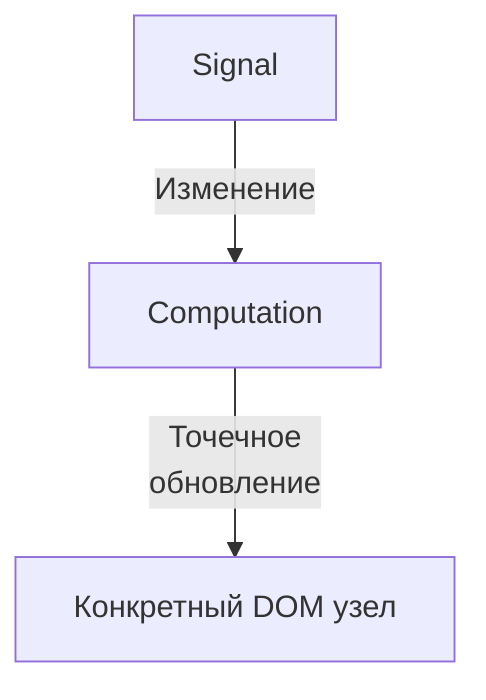

# Мемоизация в SolidJS

## Принципы работы

### Fine-grained реактивность

В отличие от React, где обновление компонента происходит целиком, SolidJS использует точечные (fine-grained) обновления. Это означает, что обновляется только тот конкретный DOM-узел, который зависит от изменившегося значения.



### Реактивные примитивы

1. **Signals** - базовые единицы реактивности:
```typescript
const [count, setCount] = createSignal(0)
// count - getter функция
// setCount - setter функция
```

2. **Effects** - автоматические подписчики:
```typescript
createEffect(() => {
  console.log(count()) // Перезапускается при изменении count
})
```

3. **Memo** - кэшированные вычисления:
```typescript
const doubled = createMemo(() => count() * 2)
// Пересчитывается только при изменении count
```

## Мутабельность vs Иммутабельность

### Иммутабельный подход (как в React)
```typescript
// ❌ Требует пересоздания всего объекта
const [user, setUser] = createSignal({ name: "John", age: 30 })
setUser(prev => ({ ...prev, age: 31 }))
```

### Мутабельный подход (Store в SolidJS)
```typescript
// ✅ Точечное обновление только age
const [user, setUser] = createStore({ name: "John", age: 30 })
setUser("age", 31)
```

## Примеры из нашей кодовой базы

### 1. Производные вычисления [FeedProvider.tsx](../src/context/feed.tsx)
```typescript
// Группировка по режимам с автоматическим отслеживанием зависимостей
const feedByMode = createMemo(() => {
  switch (mode()) {
    case 'hot': return hotFeed()
    case 'top': return topFeed()
    default: return recentFeed()
  }
})
```

### 2. Независимые обновления [TopicView.tsx](../src/components/Views/TopicView.tsx)
```typescript
// Каждое вычисление обновляется независимо
const topViewedShouts = createMemo(() => {
  const loaded = feedByTopic()?.[props.topicSlug] || []
  return [...loaded].sort(byStat('views'))
})
```

## Рекомендации по оптимизации

### 1. Гранулярность обновлений
```typescript
// ❌ Обновление всего списка
const list = createMemo(() => {
  return items().map(item => ({
    ...item,
    selected: selectedId() === item.id
  }))
})

// ✅ Точечные обновления
const isSelected = (id) => selectedId() === id
<For each={items()}>
  {item => (
    <div class={isSelected(item.id) ? "selected" : ""}>
      {item.name}
    </div>
  )}
</For>
```

### 2. Изоляция изменений
```typescript
// ❌ Смешивание статических и динамических данных
const UserCard = (props) => {
  const info = createMemo(() => ({
    name: props.user.name,        // Статическое
    online: userStatus().online,  // Динамическое
    avatar: props.user.avatar     // Статическое
  }))
}

// ✅ Разделение статических и динамических данных
const UserCard = (props) => {
  const status = createMemo(() => userStatus().online)
  return (
    <div>
      <h3>{props.user.name}</h3>
      <OnlineStatus status={status()} />
      
    </div>
  )
}
```

### 3. Использование Store для сложных объектов
```typescript
// ❌ Сигнал с объектом
const [state, setState] = createSignal({ 
  user: { name: "John" },
  settings: { theme: "dark" }
})

// ✅ Store с точечными обновлениями
const [state, setState] = createStore({ 
  user: { name: "John" },
  settings: { theme: "dark" }
})
// Обновляет только theme
setState("settings", "theme", "light")
```

## Важно помнить

1. SolidJS оптимизирован для точечных обновлений "из коробки"
2. Не нужно вручную оптимизировать простые операции
3. Используйте Store для сложных объектов с вложенными обновлениями
4. Разделяйте статические и динамические данные
5. Изолируйте области изменений для минимизации перерендеров

## Дополнительные материалы

- [Fine-grained Reactivity](https://docs.solidjs.com/advanced-concepts/fine-grained-reactivity)
- [Mutable Derivations in Reactivity](https://dev.to/this-is-learning/mutable-derivations-in-reactivity-2ffl)
- [SolidJS Reactivity Documentation](https://docs.solidjs.com/concepts/reactivity)
- [Understanding Solid's Signals](https://docs.solidjs.com/concepts/signals)
- [Ryan's Reactivity Deep Dive](https://dev.to/ryansolid/a-hands-on-introduction-to-fine-grained-reactivity-3ndf)
- [Solid Store Documentation](https://docs.solidjs.com/references/api-reference/stores/using-stores)