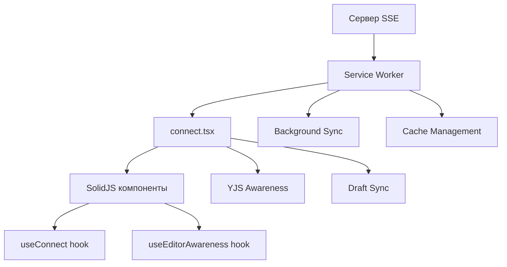

# SSE (Server-Sent Events) Architecture

## Обзор

Система SSE в Discours.io построена на **единой централизованной архитектуре** с использованием Service Worker как основной точки соединения. Вся функциональность объединена в единый модуль `src/context/connect.tsx`.

## Ключевые компоненты

### 1. Service Worker (`public/sw.js`)
- **Единственная точка SSE соединения** с сервером
- Управление фоновой синхронизацией и офлайн режимом
- Кеширование и обработка событий в фоне
- Работает даже при закрытых вкладках

### 2. Connect Context (`src/context/connect.tsx`)
- **Унифицированный контекст** для всей SSE функциональности
- Прокси для Service Worker сообщений
- YJS Awareness для совместного редактирования
- Background Sync управление
- Единая точка входа для всех SSE операций

## Архитектура потока данных



## Основные возможности

### SSE Сообщения
```typescript
interface SSEMessage {
  id: string
  entity: string // follower | shout | reaction | draft | message | cursor
  action: string // create | delete | update | join | follow | seen
  payload: Author | Shout | Topic | Reaction | Chat | Message
  created_at?: number
  seen?: boolean
}
```

### Service Worker Управление
```typescript
const { 
  register, 
  unregister, 
  ping, 
  clearCache,
  isRegistered,
  isConnected,
  error,
  version 
} = useConnect()
```

### Awareness для совместного редактирования
```typescript
const {
  connectionState,
  updateCursorPosition,
  updateEditorContent,
  getLatestContent,
  getActiveUsers
} = useEditorAwareness(editorId, draftId, fieldType)
```

## Использование

### Базовое подключение
```tsx
import { ConnectProvider, useConnect } from '~/context/connect'

// В корневом компоненте
<ConnectProvider>
  <App />
</ConnectProvider>

// В компоненте
const MyComponent = () => {
  const { addHandler, getStatus } = useConnect()
  
  useEffect(() => {
    const unsubscribe = addHandler((message) => {
      console.log('SSE сообщение:', message)
    })
    
    return unsubscribe
  }, [])
  
  return <div>Status: {getStatus()}</div>
}
```

### Совместное редактирование
```tsx
const Editor = ({ draftId }: { draftId: number }) => {
  const editorId = `draft-${draftId}`
  const {
    updateEditorContent,
    updateCursorPosition,
    getActiveUsers,
    connectionState
  } = useEditorAwareness(editorId, draftId, 'body')
  
  const handleContentChange = (content: string) => {
    updateEditorContent(content, content.trim() === '')
  }
  
  const handleCursorChange = (anchor: number, head: number) => {
    updateCursorPosition(anchor, head)
  }
  
  return (
    <div>
      <div>Подключенные пользователи: {getActiveUsers().length}</div>
      <div>Статус: {connectionState()}</div>
      {/* Редактор */}
    </div>
  )
}
```

### Обработка уведомлений
```tsx
const NotificationHandler = () => {
  const { addHandler } = useConnect()
  
  useEffect(() => {
    return addHandler((message) => {
      switch (message.entity) {
        case 'reaction':
          if (message.action === 'create') {
            showNotification('Новая реакция!')
          }
          break
        case 'message':
          if (message.action === 'create') {
            showNotification('Новое сообщение!')
          }
          break
      }
    })
  }, [])
  
  return null
}
```

## Service Worker SSE Integration

### Автоматическая регистрация
Service Worker автоматически регистрируется при инициализации `ConnectProvider`:

```typescript
onMount(() => {
  if (isSupported()) {
    register().catch(error => {
      console.error('[Connect] Автоматическая регистрация неудачна:', error)
    })
  }
})
```

### Передача токена авторизации
```typescript
// Автоматическая передача токена при изменении сессии
createEffect(
  on(session, (s) => {
    if (s?.token && serviceWorker) {
      setToken(s.token)
    }
  })
)
```

### Фоновая синхронизация
```typescript
const { requestBackgroundSync } = useConnect()

// При отсутствии соединения
if (connectionStatus !== 'connected') {
  requestBackgroundSync('draft-sync')
}
```

## Состояния соединения

- **`disconnected`** - Service Worker не зарегистрирован
- **`connecting`** - Service Worker зарегистрирован, но SSE не подключен
- **`connected`** - SSE активно и работает
- **`error`** - Ошибка соединения или регистрации

## Обработка ошибок

```typescript
const { error, getStatus } = useConnect()

if (error()) {
  console.error('Ошибка SSE:', error())
}

if (getStatus() === 'error') {
  // Показать пользователю уведомление об ошибке
}
```

## Офлайн поддержка

Service Worker автоматически:
- Кеширует критические ресурсы
- Сохраняет черновики в localStorage
- Запрашивает фоновую синхронизацию при восстановлении соединения
- Восстанавливает данные из локального хранилища

## Миграция с старой архитектуры

### Было (несколько контекстов):
```typescript
// Старый подход
import { useServiceWorker } from '~/context/worker'
import { useSSE } from '~/context/connect' 
import { useAwareness } from '~/components/SimpleRichEditor/lib/awareness'
```

### Стало (единый контекст):
```typescript
// Новый подход
import { useConnect, useEditorAwareness } from '~/context/connect'
```

## Производительность

### Преимущества централизованной архитектуры:
- **Одно SSE соединение** вместо множественных
- **Устранение дублирования** сообщений и обработчиков
- **Лучшая надежность** через Service Worker
- **Экономия ресурсов** браузера
- **Фоновая работа** даже при закрытых вкладках

### Оптимизации:
- Кеширование сообщений в памяти
- Дебаунсинг обновлений черновиков
- Ленивая инициализация Awareness провайдеров
- Автоматическая очистка неиспользуемых ресурсов

## Отладка

### Логирование
Все операции логируются с префиксом `[Connect]`:
```typescript
console.log('[Connect] SSE подключен через Service Worker')
console.log('[Connect] Токен отправлен в Service Worker')
console.log('[Connect] Запрос фоновой синхронизации: draft-sync')
```

### DevTools
- **Application → Service Workers** - статус Service Worker
- **Network → EventStream** - SSE соединения
- **Application → Local Storage** - сохраненные черновики
- **Console** - логи операций

## Безопасность

- Токены передаются только через защищенные каналы Service Worker
- Автоматическая очистка токенов при разлогинивании
- Валидация всех входящих SSE сообщений
- Изоляция данных между пользователями
